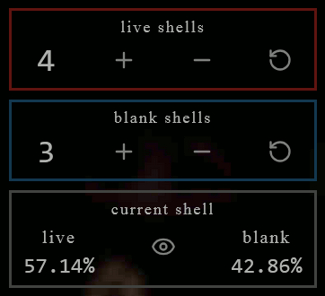
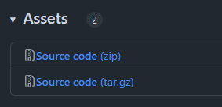
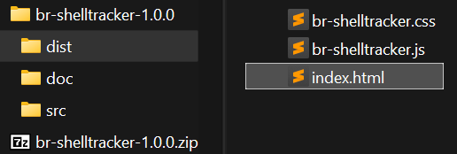
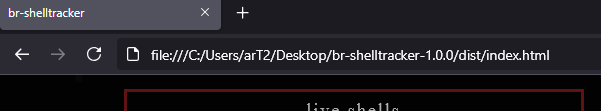

# br-shelltracker

A helper tool for the game [Buckshot Roulette](https://criticalreflex.io/buckshot_roulette).

Too baked to remember how many live and blank shells there are left? Just update the live and blank shell counts whenever the shotgun is reloaded, a shell is used, ejected, or its polarity is flipped.

## Features

- [x] Keep track of live and blank shells.
- [x] See chance for current shell to be live or blank. (toggleable)
- [x] Webbrowser based.
- [x] Works from the filesystem without webserver or internet connection.
- [x] No installation needed.
- [x] User interface is usable on small screens.
- [ ] *More? If you got ideas, open a new [issue](https://github.com/etrusci-org/br-shelltracker/issues) and let me know* 👽

## Usage

To use it, open [dist/index.html](./dist/index.html) in a webbrowser.  
I host the latest release on <https://etrusci.org/tool/br-shelltracker>.

**But you can also self-host it if you like.** To do so follow these steps:

**1. Download the latest [release](https://github.com/etrusci-org/br-shelltracker/releases).**  
In the **Assets** dropdown, download either the **zip** or **tar.gz** file and save it to your computer.

**2. Unpack the just downloaded file.**  
   You should now see a new folder that was unpacked.  
   Inside that folder should be another folder named **dist** with an **index.html** file inside.

**3. Double-click **dist/index.html** to open it with your default webbrowser,** or right-click it, then choose *open-with...* from the context menu if you do not want to use your default webbrowser.

The tool should now be opened and ready to use.

You can delete all the other files if you want and only keep the **dist** folder (and rename/move it), but the **index.html** and **br-shelltracker.\*** files have to stay in the same folder together.

## License

See [LICENSE.md](./LICENSE.md) for details.
