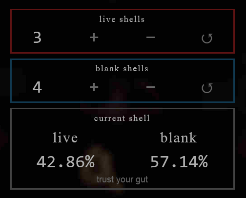
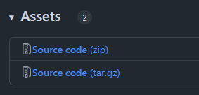
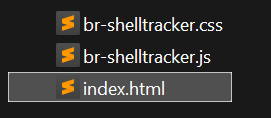

# br-shelltracker

A helper tool for the game [Buckshot Roulette](https://criticalreflex.io/buckshot_roulette).

Too baked to remember how many live and blank shells there are left?  
Just click `+` or `−` to update the displayed counts and chances whenever the shotgun is reloaded, a shell is used, ejected, or its polarity is flipped.

## Features

- [x] Keep track of live and blank shells.
- [x] See chance for current shell to be live or blank (can be toggled on/off).
- [x] Webbrowser based, no installation needed.
- [x] Works from the filesystem without internet.
- [x] User interface is usable mobile.
- [ ] *More? If you got ideas, open a new [issue](https://github.com/etrusci-org/br-shelltracker/issues) and let me know* 👽

## Usage

To use it, open [dist/index.html](./dist/index.html) in a webbrowser.  
I host the latest release on <https://etrusci.org/tool/br-shelltracker>.

**But you can also self-host it if you like.** To do so follow these steps:

**1. Download the latest [release](https://github.com/etrusci-org/br-shelltracker/releases).**  
In the **Assets** dropdown, download either the **zip** or **tar.gz** file and save it to your computer.

**2. Unpack the just downloaded file.**  
   You should now see a new folder that was unpacked.  
   Inside that folder should be another folder named **dist** with an **index.html** file inside.

**3. Double-click **dist/index.html** to open it with your default webbrowser,** or right-click it, then choose *open-with...* from the context menu if you do not want to use your default webbrowser.

The tool should now be opened in your webbrowser and ready to use.

## License

The MIT License  
See [LICENSE.md](./LICENSE.md) for more.
